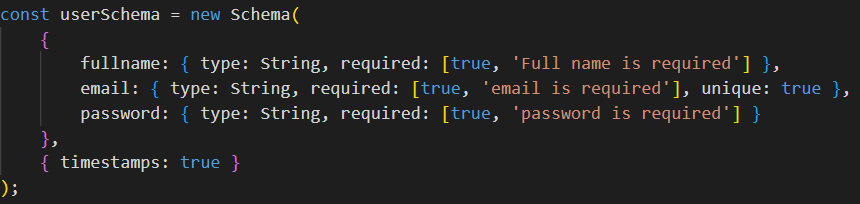
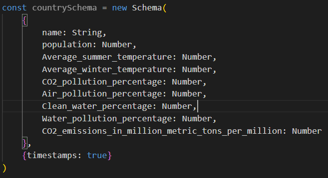
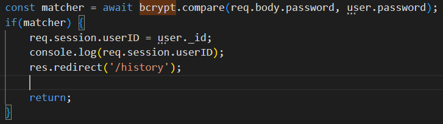

<!--- Need to add what the name of your application will be down below in the first heading> --->
# Environment Web Application
Hosted Application: https://purple-angelfish-belt.cyclic.app 
Repository Link: https://github.com/FaizanAhmedSP707/AE1_COM519

Assessment information
========================
University Name: Solent University, Southampton 
Module Name: Advanced Database Systems 
Module Code: COM519 
Assessment Number & Title: AE1, Project with Report 

Student Details
---------------
Name: Faizan Ahmed 
ID: 15575594 
Course: BSc \(Hons\) Software Engineering 
Tutor: Joe Appleton 
Submission Date: 20 Jan 2023 
Year 2 
 
Number of words: 1300

## Contents
1. Abstract.............................................................................................................................................1
2. Introduction.....................................................................................................................................2
3. Aims and Objectives.....................................................................................................................2
4. System Overview............................................................................................................................2
5. Key Design Decisions....................................................................................................................2
6. Conclusion and Reflection.........................................................................................................5
7. References........................................................................................................................................5
8. Bibliography and Learning Sources.........................................................................................6

## List of Figures and Images
1. Figure 1: Schema used for the Users' collection..................................................................3
2. Figure 2: Schema used for the collection called 'country'................................................4
3. Figure 3: Using Bcrypt for hashing passwords.....................................................................5

## 1.  Abstract

This technical report gives an insight into the creation, testing and deployment of a 
proof-of-concept data-driven full stack web application. It then focuses on how the 
application solves a real-life problem that can occur at the workplace.
 
## 2.  Introduction
<!--- This section is for describing your problem statement. --->
In the 21st century  where a lot of waste material and greenhouse gases are generated by human beings by means of various processes, such as the burning of fossil fuels for motor cars as an energy source, generating electricity by using fuels to power the generators at a power station, to deforestation practices that more than often release large volumes of the gases into the atmosphere, which in turn causes many negative side effects on the earth, such as the melting of glaciers, increase in the rise of sea levels and increase in the average temperature of the earth. All of these changes are necessary to 
In the current day and age of the 21st century, it is important to realise the importance of maintaining
an up to date record of the each of the world's countries changing environmental states, such as the level
of CO2, monthly average temperatures, so that decisions can be made by different countries as well as organisations such as Greenpeace on how to tackle the rising problem that is known as global warming.
There needs to be accurate data that is stored in a single large database so that crucial information can be shared across different organisations so that important decisions can be made at the right time.

## 3.  Aims and Objectives
*  To be able to discuss a range of approaches and techniques for addressing the issues facing modern enterprise-level databases.
*  To be able to evaluate and design database solutions based on an analysis of business requirements.
*  To be able to research novel database management systems.
*  To be able to apply database application development techniques.

## 4.  System Overview
This system uses an MVC (Model, View, Controller) architecture that uses Node.js for the backend side of the application that connect to a MongoDB database, along with EJS (Embedded JavaScript Templating), which Is “one of the most popular template engines used for JavaScript. As the name suggests, it lets us embed JavaScript code in a template language that is then used to generate HTML.”, according to Olusola (2021). The primary reason for using Node.js alongside Express.js is that it has the ability to run JavaScript code on the server-side of the application rather than the front-end which reduces compilation time for the JavaScript code as it is an interpreted language. Moreover, this advantage of an interpreted language also allows for a developer to change some lines of code quickly and see the results at a much faster pace, thus reducing development time.

A reason for using a non-relational database like MongoDB instead of something like MySQL is that it provides performance benefits such as faster query execution, horizontal scaling of databases and flexible data models, according to MongoDB (n.d.) which allows for quicker operations on the database. On the other hand, the downside to using NoSQL and non-relational databases is data integrity, however this application doesn’t require a high level of data consistency, which makes MongoDB a good choice.

## 5.  Key Design Decisions
This application uses two MongoDB databases, one is a Production database and the other is a Development database, which has two collections called \'Users\' and \'Records\':

### Users:

The \‘Users\’ collection stores a list of all users that are registered with the application. It stores information such as as their full name, email address, their password, as well as the time stamp at which the user record was created. A timestamp is auto-generated by the MongoDB database each time a user is created, this value does not need to be entered manually. A look at the schema used to store this information is shown below:

Figure 1: Schema used for the Users' collection

### Country:

The ‘Country’ collection stores individual countries with environmental data that is useful for determining strategies to formulate in order to make a positive impact on the environment. This information includes data such as the level of CO2 pollution within the country, to the level of water pollution in the country. The schema used to store this data is shown below:

Figure 2: Schema used for the collection called 'country'

#### Security:

For this application, the only private information that is being held by the database is the password of the user that registers with the application. To avoid the risk of data loss or misuse, I have made sure that only the hashes of the passwords are stored in the database, which is done by ‘Bcrypt’. Salting is also done on the password to prevent attacks such as Rainbow Table attacks, which are attempts to crack password hashes in a poorly secured database (BeyondIdentity, n.d.) by adding an extra random value to each hashed password to ensure that they are unique. Additionally, ‘Bcrypt’ is a slow performing algorithm which helps to reduce the effectiveness of brute force attacks as a result of the increased time needed to brute force any password.

Figure 3: Using Bcrypt for hashing passwords.

#### Scalability:

For this application, the only private information that is being held by the database is the password of the user that registers with the application. To avoid the risk of data loss or misuse, I have made sure that only the hashes of the passwords are stored in the database, which is done by ‘Bcrypt’. Salting is also done on the password to prevent attacks such as Rainbow Table attacks, which are attempts to crack password hashes in a poorly secured database (BeyondIdentity, n.d.) by adding an extra random value to each hashed password to ensure that they are unique. Additionally, ‘Bcrypt’ is a slow performing algorithm which helps to reduce the effectiveness of brute force attacks as a result of the increased time needed to brute force any password.

## 6.  Conclusion and Reflection
In conclusion, this web application is not suitable for use by mobile devices as it needs some modifications in order to make it responsive on a mobile device’s small screen. Furthermore, the application’s UI will need some adjustments in order to make it a feasible application for mobile devices, as this is only a proof-of-concept work.
In addition, I would like to improve the UI of this application by adding some lightweight CSS such as Tailwind to improve the visual aesthetic of the application and apply a professional look to the application.

 
 

## 7.  References
BeyondIdentity, n.d. Rainbow Table Attack [viewed 17th Jan 2023]. Available from: https://www.beyondidentity.com/glossary/rainbow-table-attack 

MongoDB, n.d. NoSQL vs. SQL Databases [viewed 17th Jan 2023]. Available from: https://www.mongodb.com/nosql-explained/nosql-vs-sql 

Olusola, 2021. How to use EJS to template your Node.js application. In: LogRocket. 24 December 2021 [viewed 17 Jan 2023]. Available from: https://blog.logrocket.com/how-to-use-ejs-template-node-js-application/ 

## 8.  Bibliography and Learning Sources
Botes, 2013. An artefact to analyse unstructured document data stores (NoSQL)

Harrison, 2015. Next Generation Databases. Australia: Apress

Kumar, 2014. Apache Hadoop, NoSQL and NewSQL Solutions of Big Data

Murthy and Bowman, 2014. Big Data and Society. Big Data solutions on a small scale: Evaluating accessible high-performance computing for social research  

Simplilearn, 2022. 'Data Types in MongoDB | Common MongoDB Data Types". Available from:  
https://www.simplilearn.com/tutorials/mongodb-tutorial/mongodb-data-types 

Tauro, 2013. Proceedings of International Conference on Emerging Research in Computing, Information, Communication and Applications. A Comparative Analysis of Different No SQL Databases on Data Model

